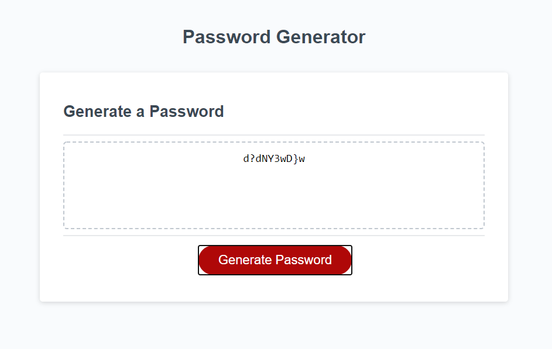

# 03 JavaScript: Password Generator

## Function

This application generates a random password based on the users input choices. 
They have the option to choose a password length between 8 to 128 characters and whether to include upper case, lower case, numbers and special characters.

When a user clicks the button "Generate Password" 
They are presented with a series of prompts for password criteria:

```
WHEN prompted for the length of the password
THEN I choose a length of at least 8 characters and no more than 128 characters.

WHEN prompted for character types to include in the password
THEN I choose lowercase, uppercase, numeric, and/or special characters.

WHEN I answer each prompt
THEN my input should be validated and at least one character type should be selected.

WHEN all prompts are answered
THEN a password is generated that matches the selected criteria.

WHEN the password is generated
THEN the password is either displayed in an alert or written to the page.
```


## Screenshot

The following image shows the web application's appearance and functionality:




## Links

Github Repository: https://github.com/Cmonge135/password-generator
